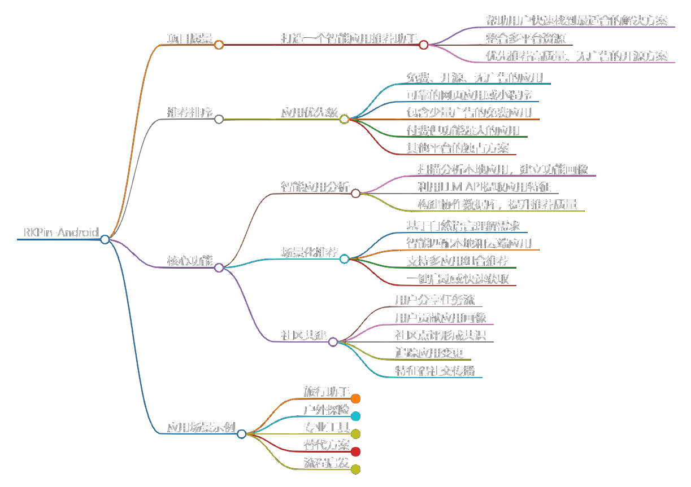
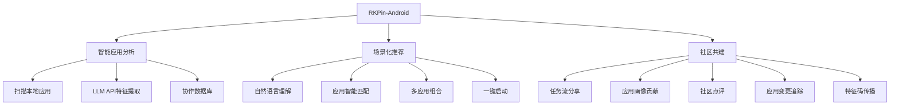
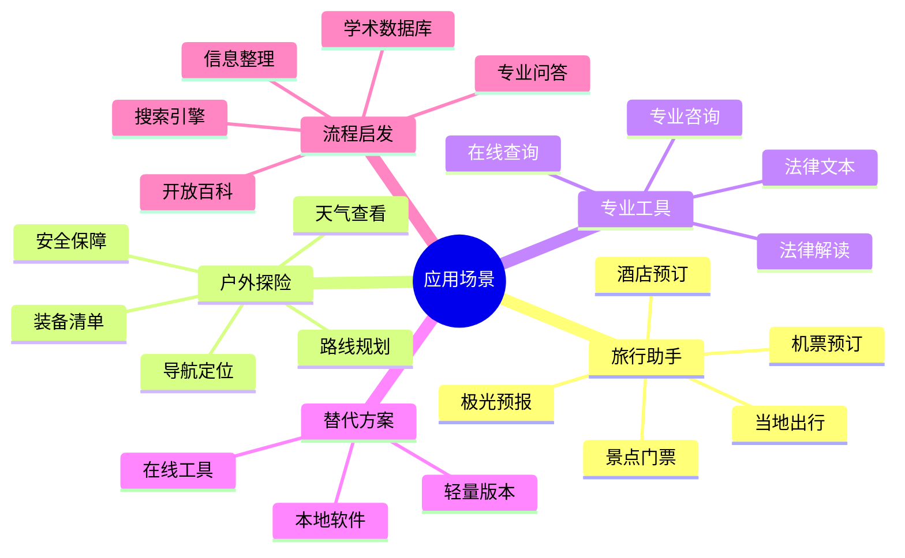

# RKPin-Android

基于RKPin-Web的安卓端扩展，提供智能应用推荐和快捷启动能力。

## 推荐排序
1. 免费、开源、无广告的应用
2. 可靠的网页应用或小程序
3. 包含少量广告的免费应用
4. 付费但功能强大的应用
5. 其他平台的独占方案

## 核心功能

### 智能应用分析
- 扫描分析本地应用，建立功能画像
- 利用LLM API提取应用特征
- 构建协作数据库，提升推荐质量

### 场景化推荐
- 基于自然语言理解需求
- 智能匹配本地和云端应用
- 支持多应用组合推荐
- 一键启动或快速获取

### 社区共建
- 用户分享自己的任务流，对应解决一个具体任务
- 用户贡献应用画像
- 针对任务流、应用画像进行点评，形成社区共识
- 追踪应用变更（如下架、加广告、功能变更），及时更新画像，优化推荐
- 通过特征码，用户的应用画像和任务流可在社交媒体上传播

## 应用场景示例

### 旅行助手
"我想去冰岛旅游，需要什么准备？"
- 机票预订：Skyscanner/Momondo
- 当地出行：Google Maps/Reykjavik Excursions
- 景点门票：GetYourGuide/Viator
- 酒店预订：Booking/Airbnb
- 极光预报：My Aurora Forecast
- 冰岛语翻译：Google Translate/iTranslate
- 户外装备：REI/Decathlon

### 户外探险
"第一次去野外露营，需要准备什么？"
- 路线规划：AllTrails/OS Maps
- 天气查看：彩云天气Pro
- 装备清单：PackPoint/Camping Checklist
- 装备购买/租赁：迪卡侬/咸鱼
- 野外生存技能：SAS生存指南/WikiCamps
- 安全保障：救援电话/紧急求助APP
- 导航定位：高德地图/北斗导航
- 营地预订：露营地/Hipcamp

### 专业工具
"怎么查民法典"
- 法律文本：中国民法典App/国家法律法规数据库
- 在线查询：法信/无讼
- 法律解读：法律快车/法律图书馆
- 专业咨询：找法网/律师365

### 替代方案
"想找个免费的PS替代品"
- 在线工具：Photopea
- 本地软件：GIMP/Krita
- 轻量版本：Snapseed
- 特定功能：Remove.bg/Canva

### 流程启发
"如何正确的搜索知识"
- 搜索引擎：Google高级搜索/Bing学术搜索
- 学术数据库：CNKI/Web of Science
- 专业问答：知乎/Quora/Stack Exchange
- 开放百科：维基百科/百度百科
- 电子图书馆：Z-Library/Internet Archive
- 视频教程：Coursera/edX/中国大学MOOC
- 专业论坛：Reddit学术社区/ResearchGate
- 搜索技巧：Google搜索技巧指南/信息检索课程
- 信息整理：Notion/Evernote/Zotero
